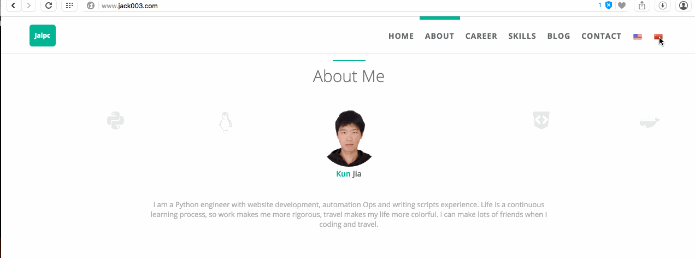
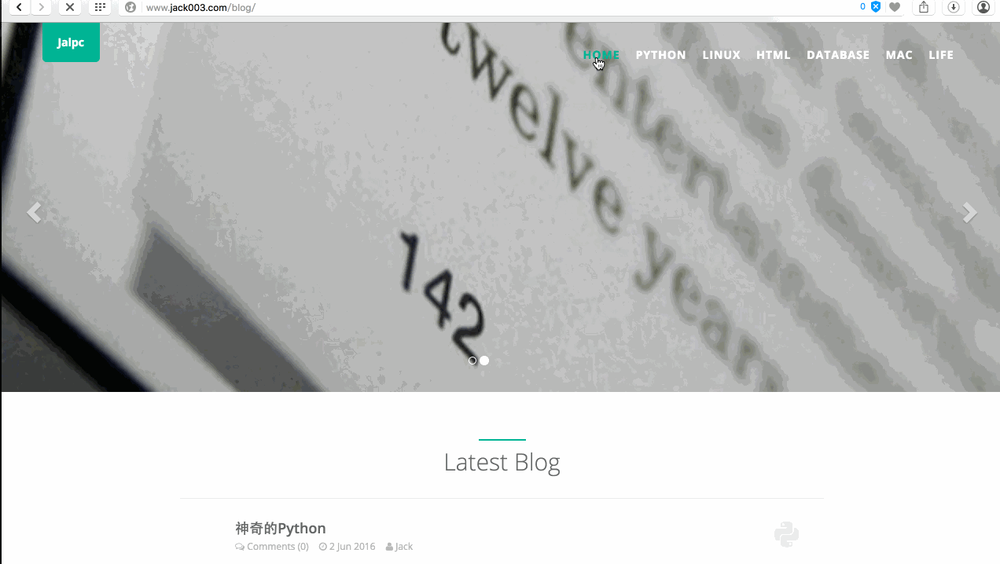

# Jalpc. [](https://github.com/Jack614/jalpc_jekyll_theme)

[](https://opensource.org/licenses/mit-license.php)
[](http://github.com/badges/stability-badges)
[](https://github.com/ellerbrock/open-source-badge/)

<http://www.jack003.com>



This is a simple, beautiful and swift theme for Jekyll. It's mobile first, fluidly responsive, and delightfully lightweight.

It's pretty minimal, but leverages large type and drastic contrast to make a statement, on all devices.

The landing page of the blog is bilingual page.

If you like this Jekyll theme,please give me encouragement and star this project,I will make it better.

## Ad

[Jalpc-A](https://github.com/Jack614/Jalpc-A): another Jekyll theme written by [AngularJS](https://angularjs.org/).

## Getting Started

If you're completely new to Jekyll, I recommend checking out the documentation at <http://jekyllrb.com> or there's a tutorial by Smashing Magazine.

#### Fork, then clone

**Fork** the repo, and then **clone** it so you've got the code locally.

```
$ git clone https://github.com/<your githubname>/jalpc_jekyll_theme.git
$ cd jalpc_jekyll_theme
$ gem install jekyll # If you don't have jekyll installed
$ rm -rf _site && jekyll server
```

### Modify the `_config.yml`

The _config.yml located in the root of the jalpc_jekyll_theme directory contains all of the configuration details for the Jekyll site. The defaults are:

``` yml
# Website settings
title: "Jalpc"
description: "Jack's blog,use Jekyll and github pages."
keywords: "Jack,Jalpc,blog,Jekyll,github,gh-pages"

baseurl: "/"
url: "http://www.jack003.com"
# url: "http://127.0.0.1:4000"

# author
author:
  name: 'Jack'
  first_name: 'Jia'
  last_name: 'Kun'
  email: 'jack19890614@gmail.com'
  facebook_username: 'jiakunnj'
  github_username: 'Jack614'
  head_img: 'static/img/landing/Jack.jpg'

# social link
jingyu:
  first_name: 'Yu'
  last_name: 'Jing'
  description: 'Painter.'
  link: 'http://angular.jack003.com'
  email: '805963294@qq.com'

# landing page
landing:
  home: 'Home'
  about: 'About'
  career: 'Career'
  skills: 'Skills'
  projects: 'Project'
  blog: 'Blog'
  contact: 'Link'

# my projects
project:
  saplatform:
    name: 'Saplatform'
    url: '/Jack614/saplatform'
    img: 'static/img/landing/saplatform.jpg'
  jalpc:
    name: 'Jalpc'
    url: '/Jack614/jalpc_jekyll_theme'
    img: 'static/img/landing/jekyll.jpg'
  angularjs:
    name: 'Jalpc-A'
    url: '/Jack614/Jalpc-A'
    img: 'static/img/landing/angularjs.jpg'

# blog index
index:
  home: 'Home'
  python: 'Python'
  linux: 'Linux'
  html: 'HTML'
  database: 'Database'
  mac: 'Mac'
  life: 'Life'

...
```
### Jekyll Serve

Then, start the Jekyll Server. I always like to give the --watch option so it updates the generated HTML when I make changes.

```
$ jekyll serve --watch
```

Now you can navigate to localhost:4000 in your browser to see the site.

### Using Github Pages

You can host your Jekyll site for free with Github Pages. [Click here](https://pages.github.com) for more information.

A configuration tweak if you're using a gh-pages sub-folder

In addition to your github-username.github.io repo that maps to the root url, you can serve up sites by using a gh-pages branch for other repos so they're available at github-username.github.io/repo-name.

This will require you to modify the _config.yml like so:

``` yml
# Welcome to Jekyll!

# Site settings
title: Repo Name

baseurl: "/"
url: "http://github-username.github.io"
# url: "http://127.0.0.1:4000"

# author
author:
  name: nickname
  first_name: firstname
  last_name: lastname
  email: your_email@example.com
  facebook_username: facebook_example
  github_username: 'github_example
  head_img: 'path/of/head/img'

# landing page
landing:
  home: landing-1
  about: landing-2
  career: landing-3
  skills: landing-4
  blog: landing-5
  contact: landing-6

# blog index
index:
  home: index-1
  python: index-2
  linux: index-3
  html: index-4
  database: index-5
  mac: index-6
  life: index-7

# blog img path
img_path: '/path/of/blog/img/'
```

If you start server on localhost, you can turn on `# url: "http://127.0.0.1:4000"`.

### Pagination

The pagination in jekyll is not very perfect,so I use front-end web method,there is a [blog](http://www.jack003.com/html/2016/06/04/jekyll-pagination-with-jpages.html) about the method and you can refer to [jPages](http://luis-almeida.github.io/jPages).

### Page counter

Many third party page counter platform is to slow,so I count my website page view myself,the javascript file is `static/js/count_index.js`,the backend is [Leancloud](https://leancloud.cn).

### Bilingual Page

The landing page of the blog is bilingual page,when you click national flag,the page language changes.The fllowing is how to set up bilingual page.

#### Step 1

To add i18 support for your app you need to define what text you would like to translate. The best way to define your text is to store it in external json file. For example:

**Each language you should have own json file!**

en.json

``` json
{
  "website":{
    "title": "Jalpc"
  },
  "nav":{
    "home": "Home",
    "about_me": "About",
    "skills": "Skills",
    "career": "Career",
    "blog": "Blog",
    "contact": "Contact"
  }
}
```

cn.json

``` json
{
  "website":{
    "title": "杰克的博客"
  },
  "nav":{
    "home": "首页",
    "about_me": "关于我",
    "skills": "技能",
    "career": "职业",
    "blog": "博客",
    "contact": "联系我"
  }
}
```

#### Step 2

Next you need to add html indicators in all place you want to use i18.(index.html)

``` html
<a class="navbar-brand" href="#page-top" id="i18_title"><span data-i18n="website.title">{{ site.title }}</span></a>
```

#### Step 3

Next you need to initialise the i18next plugin:
json files are located in `static/locales` folder.

``` javascript
$.i18n.init(
    resGetPath: 'locales/__lng__.json',
    load: 'unspecific',
    fallbackLng: false,
    lng: 'en'
}, function (t)
    $('#i18_title').i18n();
});
```

#### Step 4

After that if you want to change the language you just need to add buttons and fire the i18n.setLng() function.

HTML markup

``` html
<a class="btn btn-sm set_en"></a>
<a class="btn btn-sm set_cn"></a>
```

Javascript code

``` javascript
$('.set_en').on('click', function (){
    i18n.setLng('en', function(){

        $('#i18_title').i18n();

   });
});

$('.set_cn').on('click', function (){
    i18n.setLng('cn', function(){

        $('#i18_title').i18n();

    });
});
```

Link: [i18next](http://i18next.github.io/i18next/)

### Web analytics

I use [Baidu analytics](http://tongji.baidu.com/web/welcome/login) and [Google analytics](https://www.google.com/analytics/) to do web analytics, you can choose either to realize it,just register a account and replace id in `_config.yml`.

### Comment

I use [Changyan](http://changyan.kuaizhan.com/) and [Disqus](https://disqus.com/) to realize comment.

#### Changyan
To configure Changyan, get the appid and conf in <http://changyan.kuaizhan.com/>. Then, in `_config.yml`, edit the changyan value to enable Changyan.

#### Disqus
To configure Disqus,you should set disqus_shortname and get public key and then, in `_config.yml`, edit the disqus value to enable Disqus.

### Share

I use [bshare](http://www.bshare.cn/) to share my blog on other social network platform. You can register a count and get your share uuid.

### Search engines

I use javascript to realize blog search,you can double click `Ctrl` or click the icon at lower right corner of the page,the detail you can got to this repo: <https://github.com/androiddevelop/jekyll-search>.

Just use it.



### CNAME

Replace your website domain in **CNAME** file.

### Put in a Jalpc Plug

If you want to give credit to the Jalpc theme with a link to my personal website <http://www.jack003.com>, that'd be awesome. No worries if you don't.

### Enjoy

I hope you enjoy using Jalpc. If you encounter any issues, please feel free to let me know by creating an issue. I'd love to help.

## Upgrading Jalpc

Jalpc is always being improved by its users, so sometimes one may need to upgrade.

### Ensure there's an upstream remote

If `git remote -v` doesn't have an upstream listed, you can do the following to add it:

```
git remote add upstream https://github.com/johnotander/pixyll.git
```

### Pull in the latest changes

```
git pull upstream master
```

There may be merge conflicts, so be sure to fix the files that git lists if they occur. That's it!

## Thanks to the following

* [Jekyll](http://jekyllrb.com)
* [Bootstrap](http://www.bootcss.com)
* [jPages](http://luis-almeida.github.io/jPages)
* [i18next](http://i18next.github.io/i18next)
* [pixyll](https://github.com/johnotander)
* [androiddevelop](https://github.com/androiddevelop)

## Contributing

1. Fork it
2. Create your feature branch (`git checkout -b my-new-feature`)
3. Commit your changes (`git commit -am 'Add some feature'`)
4. Push to the branch (`git push origin my-new-feature`)
5. Create new Pull Request

